# Hello Tamriel

### LEGEND

"Why do you think your world has always been contested ground, the arena of powers and
immortals? It is Tamriel, the Realm of Change, brother to Madness, sister to Deceit."

### DESCRIPTION

Create a program that outputs the text below to the standard output followed by a newline.

### Received knowledge
1. [Basics of I/O library](https://en.cppreference.com/w/cpp/io)
2. [iostream](https://en.cppreference.com/w/cpp/io/basic_iostream)
2. [istream](https://en.cppreference.com/w/cpp/io/basic_istream)
3. [ostream](https://en.cppreference.com/w/cpp/io/basic_ostream)

### How to Build?
```bash
 cmake . -B build && cmake --build ./build
 ```

### Usage
