# Print Dialog

### LEGEND

"M'aiq’s father was also called M'aiq.
As was M'aiq’s father’s father.
At least, that is what his father said.
But then again, you can never trust a liar."

### DESCRIPTION

Create a function that:
* takes two C++ style strings: `name` and `sentence`
* prints the quote in the format `<name> says: "<sentence>"` with a new line

See CONSOLE OUTPUT for an example of a program, which uses such function with the name
"Guard" and the sentence "I used to be an adventurer like you. Then I took an arrow in
the knee...".
Take into accout, your program must work even with empty strings.

### Received knowledge
1. [std::string](https://en.cppreference.com/w/cpp/string/basic_string)

### How to Build?
```bash
 cmake . -B build && cmake --build ./build
 ```

### Synopsis
```c++
void printDialog(const std::string& name, const std::string& sentence);
```

### Usage
