# Wallet Manager

### LEGEND

The Septim is the main currency in all of Tamriel. It is named after the dynasty that
rules the Septim Empire founded by Tiber Septim. It is officially called a Septim due to
the engraving of Tiber Septim on the obverse side.
We need some money, to survive in this world. Hmm... I think we can create them!

### DESCRIPTION

Create a set of functions that will manipulate Wallets. Use the struct `Wallet` in `walletManager.h`
which is listed in the SYNOPSIS.
Create the following functions:
* `createWallet` creates a single wallet with the given amount of Septims
* `destroyWallet` destroys a given wallet (just one)
* `createWallets` creates a given number of wallets (loops are forbidden)
* `destroyWallets` destroys multiple wallets (loops are forbidden)

To test, compile your functions with our `main.cpp` which is listed in the SYNOPSIS. In C,
we allocated and freed memory with `malloc` and `free` functions. Forget it. Now you are in
world of C++. Use C++ methods.

### Received knowledge
1. [Dynamic Memory Allocation](http://www.cplusplus.com/doc/tutorial/dynamic/)
1. [Data structures](http://www.cplusplus.com/doc/Tutorial/structures/)
2. [new](https://en.cppreference.com/w/cpp/language/new)
3. [delete](https://en.cppreference.com/w/cpp/language/delete)

### How to Build?
```bash
 cmake . -B build && cmake --build ./build
 ```

### Synopsis
```c++
struct Wallet 
{
    int septims;
};
```

```c++
#include "walletManager.h"

int main() 
{
    Wallet* wallet = createWallet(10);
    std::cout << "I've got " << wallet->septims << " septims in the wallet." << std::endl;
    destroyWallet(wallet);
    
    int amount = 5;
    Wallet* wallets = createWallets(amount);
    
    for (int i = 0; i < amount; i++) 
    {
    wallets[i].septims = i * i;
    std::cout << i << " wallet: " << wallets[i].septims << " septims." << std::endl;
    }
    destroyWallets(wallets);
    
    return 0;
}
```

### Usage
