#Cast Spells

### LEGEND

"Welcome, welcome! We were just beginning. Please, stay and listen. So, as I was saying,
the first thing to understand is that magic is, by its very nature, volatile and dangerous.
Unless you can control it, it can and will destroy you."

### DESCRIPTION

Create two functions:
* castFloatToInt casts float to int
* castToNonConstIntPtr casts const int* to int*
Forget about C-like casting. Don't do that here.

### Received knowledge
1. [Standard Conversions](https://en.cppreference.com/w/cpp/language/implicit_conversion)
1. [const_cast](https://en.cppreference.com/w/cpp/language/const_cast)
2. [static_cast](https://en.cppreference.com/w/cpp/language/static_cast)
3. [dynamic_cast](https://en.cppreference.com/w/cpp/language/dynamic_cast)
4. [reinterpret_cast](https://en.cppreference.com/w/cpp/language/reinterpret_cast)
5. [Explicit Cast](https://en.cppreference.com/w/cpp/language/explicit_cast)
5. [user-defined Conversion](https://en.cppreference.com/w/cpp/language/cast_operator)

### How to Build?
```bash
 cmake . -B build && cmake --build ./build
 ```

###Synopsis
```c++
int castFloatToInt(float number);
int* castToNonConstIntPtr(const int* ptr);
```

### Usage
