# Reference Or Pointer

### LEGEND

"Those born under the Mage have more magicka and talent for all kinds of spellcasting,
but are often arrogant and absent-minded."

### DESCRIPTION

Create two functions that multiply the integer value that is stored in the pointer and in
the reference by mult .

### Received knowledge
1. [Pointers](https://www.programiz.com/cpp-programming/pointers)
2. [References](https://en.cppreference.com/w/cpp/language/reference_initialization)

### How to Build?
```bash
 cmake . -B build && cmake --build ./build
 ```

### Synopsis
```c++
void multiplyByPointer(int* ptr, int mult);
void multiplyByReference(int& ref, int mult);
```

### Usage
