# Automaton

### LEGEND

"Dwarven military machines also range from the human-sized "Sphere" warrior, which patrols
the interiors of the ruins as a harmless ball only to emerge from it as a fully armed
and armored automaton fighter, to the justly feared "Centurion" whose height ranges from
twice to several hundred times human size depending on which reports you believe."

### DESCRIPTION

Create a program that:
* receives unit specifications as command-line arguments
* gets the name as an `std::string` , level as an `int` , health as a `float` , and stamina
as a `double`
* prints unit specifications to the standard output. See the output format in the
CONSOLE OUTPUT
* uses only `auto` instead of any other variable types
* informs the user if a wrong amount of command-line arguments have been provided with
the message usage: `./automaton [name] [level] [health] [stamina]` to the standard
error stream
* informs the user if invalid command-line arguments have been provided with the
message
`Invalid argument: <value>` to the standard error stream
Valid arguments for level, health, and stamina:
* include digits
* can include a maximum of one plus or minus sign
* health and stamina may also include one period

### Received knowledge
1. [auto](https://docs.microsoft.com/en-us/cpp/cpp/auto-cpp?view=msvc-160)
2. [std::cerr](https://en.cppreference.com/w/cpp/io/cerr)
3. [std::stoi](https://en.cppreference.com/w/cpp/string/basic_string/stoi)
4. [std::stof](https://en.cppreference.com/w/cpp/string/basic_string/stof)
5. [std::stod](https://en.cppreference.com/w/cpp/string/basic_string/stod)

### How to Build?
```bash
 cmake . -B build && cmake --build ./build
 ```

### Usage
