# Mead Song

### LEGEND

"I wonder if Vilod is still making that mead with Juniper Berries mixed in."

### DESCRIPTION

Create a program that outputs the lyrics of a song. Pattern is simple. Look at the CONSOLE
OUTPUT carefully to see the lyrics. You need to recognize the pattern by yourself.
Start with 99 bottles of mead, until the bottles run out. Instead of `...` output all song
lines. Think wise! You need to remove as much code duplication as you possibly can.
Hardcoding of entire song is forbidden!

### Received knowledge
1. Pattern Recognition
2. Refactoring
3. Optimization

### How to Build?
```bash
 cmake . -B build && cmake --build ./build
 ```

### Usage
