# Inventory

### LEGEND

Every traveller needs an inventory! The number of items that a character may carry is
based on their weight and how much the character can hold. In most cases, the more items
you have, the more weight you have (arrows, quest-related items with some exceptions, and
keys do not have any weight). The inventory is divided into such categories: Favorites,
Weapons, Apparel, Potions, Scrolls, Food, Ingredients, Books, Keys and Miscellaneous.

### DESCRIPTION

Create a program that manages an inventory. Implement a simple inventory manager using
the standard input stream `stdin` . The inventory has a limited size - only 12 items.
There are 4 item types:
* `w` - weapon
* `f` - food
* `a` - armor
* `p` - potion
The program handles 5 commands:
* `insert <itemType>` - adds the item to the inventory
* `remove` <itemType> - removes the first occurrence of the item from the inventory
* `show` - shows the inventory contents
* `help` - shows available commands
* `exit` - quits the program

The program prints:
* `Enter command:>` - before each command
* `<itemType> was inserted.` - in case of successful item insertion
* `<itemType> was removed.` - in case of successful item removal
* `Inventory { w f a p w w - - - - - - }` - inventory example with 5 items where `-` is
the status of empty slots
* errors:
    - `Invalid command.` - in case of invalid commands
    - `Invalid item.` - in case of invalid items
    - `Inventory is full.` - in case of full inventory
    
If there is more than 1 error, the program prints only 1 error message according
to the priority listed above.
* the help message - see in the CONSOLE OUTPUT for detailed example
* `Bye.` - in case of exit
For nice implementation, look at `sequential containers` and choose one to store your
items in.


### Received knowledge
1. [std::cin](https://en.cppreference.com/w/cpp/io/cin)
2. [Containers](https://en.cppreference.com/w/cpp/container)

### How to Build?
```bash
 cmake . -B build && cmake --build ./build
 ```

### Usage
