# Simple Sort

### DESCRIPTION

Create a program that sorts command-line arguments in `ASCII` order. The program works only
with exactly 5 arguments.
The program prints usage: `./simpleSort arg1 arg2 arg3 arg4 arg5` to the standard error in
case of invalid number of arguments.
Use `std::array` and `standard library function` for sorting.

### Received knowledge
1. [std::array](https://en.cppreference.com/w/cpp/container/array)
2. [std::sort](https://en.cppreference.com/w/cpp/algorithm/sort)

### How to Build?
```bash
 cmake . -B build && cmake --build ./build
 ```

### Usage
