# Move Along

### LEGEND
Today you have the honor of working with Ganciele Douar! Help him to make sure that
thieves will not go through the post. Names of the thieves should be familiar to you.

### DESCRIPTION

Create a program that prints `<name>`, move along! to the standard output if a command-
line argument contains one of these names: `mercer, emer, jim` (case insensitive).

The program prints usage: `./moveAlong [args]` to the standard error if there is no command-
line arguments.

Use `std::vector`.

### Received knowledge
1. [std::vector](https://en.cppreference.com/w/cpp/container/vector)

### How to Build?
```bash
 cmake . -B build && cmake --build ./build
 ```

### Usage
