# Visit All

### LEGEND
New quest, traveller! Stock up with stamina potions, the road won't be short.

### DESCRIPTION

Create a program that calculates the best town to start the journey. The best town to
start the journey is the one that helps you to finish the journey without getting exhausted.
The program prints the route of the journey to the standard output. See a detailed example
in the CONSOLE OUTPUT.
Towns are arranged in a chain and form an enclosed circle, where the first town is next
to the last one. The initial sequence of towns is given by order of command-line arguments.
The traveler can only move only clockwise. For example, if the sequence of towns is
Aldruhn, Helgen, Winterhold; the only possible solutions may be (depending on stamina
and distance) are:
* Aldruhn, Helgen, Winterhold
* Winterhold, Aldruhn, Helgen
* Helgen, Winterhold, Aldruhn

In this case: Aldruhn, Winterhold, Helgen - is not a valid solution (wrong direction).
A valid name of town contains only letters and spaces.
  
Each town is defined by `name, stamina, distance` command-line argument where:
* `name` - the name of the town
* `stamina` - the amount of stamina potions available in the town
* `distance` - the distance from the current town to the next one

With 1 stamina potion, the traveller can go 1 unit of distance.
If there are more than one `best town to start the journey`, the program prints the route
for the one that goes first in the queue.
The program prints errors to the standart error:
* if there is no command-line arguments - `usage: ./visitAll [[name,stamina,distance] ...]`
* in case of invalid arguments - `Argument <argument> is not valid`
* if it is impossible to finish the journey with given stamina and distance, or in a
case when only one town is specified - `Mission: Impossible`

### Received knowledge
1. [std::deque](https://en.cppreference.com/w/cpp/container/deque)

### How to Build?
```bash
 cmake . -B build && cmake --build ./build
 ```

### Usage
