# Standard Algorithms V1

### LEGEND
Most of the NPCs in Skyrim are named characters. Quest-givers, trainers, merchants, as
well as most NPCs in cities and towns are named characters.

### DESCRIPTION

Create a program that analyzes names. The program takes file as a command-line argument
with a list of names, one per line.
Using `standard library algorithms` and `std::forward_list` , get and print to the standard
output the following information:
* `size: <amount>` - the number of names listed in the file
* `contains 'rich': <true || false>` - `true` if any of names contain substring 'rich'
and `false` otherwise
* `none of lengths is 15: <true || false> `- `true` if none of names' length is equal to
15 and `false` otherwise
* `all end with 'vel': <true || false> ` - `true` if all names end with 'vel' and `false`
otherwise
* `without 'mel': <amount>` - number of names that don't contain the substring 'mel'
Get the most out of the STL. You can use ready-made functions to simplify development.

Error handling. The program prints errors to the standard error:
* in case of invalid number of arguments - `usage: ./stdAlgoV1 [file_name]`
* in case of any other errors - `error`
A valid file can be opened for reading. (An empty file is still a valid one)

### Received knowledge
1. [<algorithm>](https://en.cppreference.com/w/cpp/header/algorithm)
2. [std::distance](https://en.cppreference.com/w/cpp/iterator/distance)
3. [std::forward_list](https://en.cppreference.com/w/cpp/container/forward_list)

### How to Build?
```bash
 cmake . -B build && cmake --build ./build
 ```

### Usage
